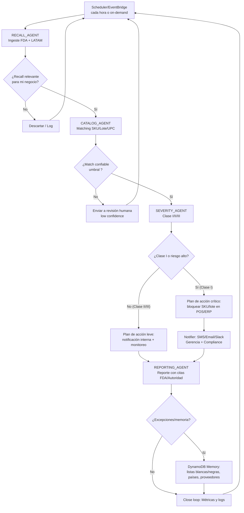

# Problem
La FDA y autoridades en latam hacen _recalls_. Farmacias, distribuidoras y rests no toman a tiempo las alertas -> brotes de infecciones, sanciones y perdida monetaria.

## Solution
RecallShield es un agente multi-IA en AWS que monitorea recalls oficiales, cruza datos con el inventario, evalúa severidad y ejecuta acciones inmediatas como bloquear SKUs, notificar clientes y generar reportes regulatorios.

## Antecedentes
Casos recientes de mantequilla de maní (Salmonella) y gotas oftálmicas contaminadas causaron hospitalizaciones y muertes por no aplicar recalls a tiempo. RecallShield reduce el tiempo de reacción de días a minutos, protegiendo la salud pública y evitando sanciones.


## Datasets

### FDA

```json 
openfda {'application_number': ['BLA103976'], 'brand_name': ['XOLAIR'], 'generic_name': ['OMALIZUMAB'], 'manufacturer_name': ['Genentech, Inc.'], 'product_ndc': ['50242-040', '50242-214', '50242-215', '50242-227'], 'product_type': ['HUMAN PRESCRIPTION DRUG'], 'route': ['SUBCUTANEOUS'], 'substance_name': ['OMALIZUMAB'], 'rxcui': ['1657209', '1657212', '2058943', '2058946', '2058949', '2058950', '2663917', '2663918', '2663920', '2663923', '2673760', '2673761', '2673762', '2673763'], 'spl_id': ['0c18e533-1b61-4224-9e5c-05cd1eb86f2b'], 'spl_set_id': ['7f6a2191-adfb-48b9-9bfa-0d9920479f0d'], 'package_ndc': ['50242-040-62', '50242-040-86', '50242-214-01', '50242-214-86', '50242-214-03', '50242-214-55', '50242-214-99', '50242-214-83', '50242-215-86', '50242-215-01', '50242-215-03', '50242-215-55', '50242-215-99', '50242-215-83', '50242-227-01', '50242-227-55', '50242-227-99', '50242-227-86'], 'is_original_packager': [True], 'nui': ['N0000175794', 'N0000175793', 'N0000175792'], 'pharm_class_epc': ['Anti-IgE [EPC]'], 'pharm_class_pe': ['Decreased IgE Activity [PE]'], 'pharm_class_moa': ['IgE-directed Antibody Interactions [MoA]'], 'unii': ['2P471X1Z11']}

```



- https://www.fda.gov/food/outbreaks-foodborne-illness/fda-investigated-multistate-outbreak-e-coli-o157h7-infections-linked-romaine-lettuce-yuma-growing
- https://edition.cnn.com/2023/05/19/health/ezricare-eye-drops-recall-update
- https://www.reuters.com/business/healthcare-pharmaceuticals/us-fda-says-india-made-eye-drop-linked-some-infections-blindness-one-death-2023-02-03/

